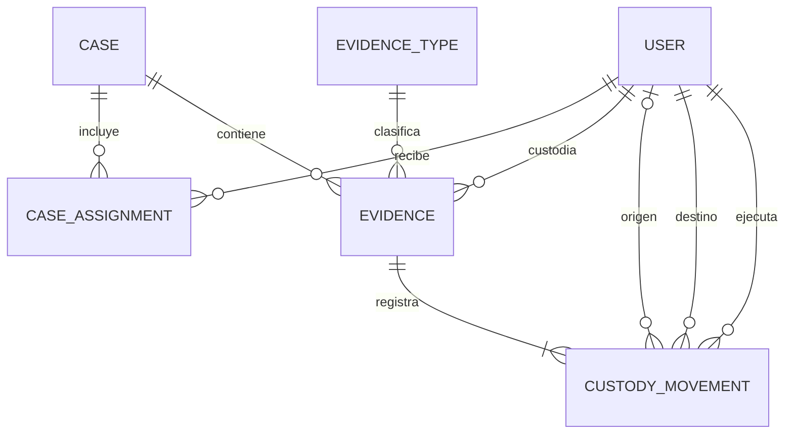

# Digital Custody

Digital Custody es una aplicación web académica para registrar casos de análisis informático, administrar evidencias digitales y mantener una cadena de custodia trazable.

## Problema que resuelve

En una investigación informática es necesario conocer qué evidencia existe, a qué caso pertenece, quién es su custodio actual y conservar el historial completo de transferencias. La aplicación registra cada cambio de custodia como un movimiento auditable que no puede editarse ni eliminarse desde el back-office.

## Arquitectura

Es una aplicación monolítica de Ruby on Rails. El back-office utiliza controladores Rails y vistas ERB. Active Record concentra la persistencia y las reglas del dominio; PostgreSQL mantiene claves foráneas, restricciones e índices. La transferencia se encapsula en `EvidenceTransferService` y se ejecuta dentro de una transacción.

## Tecnologías

- Ruby 3.2.3
- Ruby on Rails 8.1.3.1
- PostgreSQL 16
- Active Record
- ERB y CSS
- Minitest

El desarrollo local se realiza en Ubuntu 24.04 mediante WSL 2.

## Modelos y relaciones

- `User`: administrador o analista.
- `Case`: investigación con analistas y evidencias.
- `CaseAssignment`: asignación de un analista a un caso.
- `EvidenceType`: catálogo de tipos de evidencia.
- `Evidence`: evidencia con un custodio actual.
- `CustodyMovement`: registro inmutable de una asignación o transferencia.



## Instalación y ejecución

Desde PowerShell, ingresar a Ubuntu:

```powershell
wsl -d Ubuntu
```

Dentro de Ubuntu:

```bash
cd /mnt/c/UTN/programacion4/trabajo
sudo pg_ctlcluster 16 main start
bundle install
bundle exec rails db:prepare
bundle exec rails db:seed
bundle exec rails server
```

Abrir `http://localhost:3000/admin/login`.

## Credenciales de demostración

- Administrador: `admin@example.com`
- Contraseña: `password123`
- Analistas: `juan@example.com` y `maria@example.com`
- Contraseña de analistas: `password123`

Estas credenciales son únicamente para desarrollo y demostración.

## Rutas principales

| Ruta | Función |
| --- | --- |
| `/admin/login` | Ingreso administrativo |
| `/admin` | Dashboard |
| `/admin/cases` | Casos |
| `/admin/evidences` | Evidencias |
| `/admin/evidence_types` | Tipos de evidencia |
| `/admin/users` | Usuarios |
| `/admin/custody_movements` | Historial de custodia |
| `/api/v1/cases` | Consulta JSON de casos |
| `/api/v1/evidences` | Consulta JSON de evidencias |

La API requiere autenticación mediante Bearer token. Se obtiene con `POST /api/v1/login` enviando `email` y `password` en JSON. El token vence a las 24 horas y se revoca con `DELETE /api/v1/logout`. La creación de casos por API requiere rol administrador.

## Testing

```bash
bundle exec rails test
```

Los tests principales cubren validaciones únicas, autenticación administrativa, registro inicial y las reglas transaccionales de transferencia de custodia.

## Estado del proyecto

Implementado:

- modelos y migraciones PostgreSQL;
- autenticación administrativa mediante sesión;
- back-office con dashboard;
- gestión de casos, evidencias, tipos y usuarios;
- registro inicial de custodia;
- historial de cadena de custodia;
- transferencia transaccional de evidencias;
- seeds idempotentes para la demostración;
- tests principales;
- API JSON pública de consulta para casos y evidencias.

Pendiente:

- deploy en Easypanel y verificación de persistencia con volumen, según `docs/DEPLOY_EASYPANEL.md`;
- validación final del CI y la instancia publicada.

La rama de finalización incorpora autenticación por token, adjuntos de Active Storage, Action Mailer para transferencias cuando se configure SMTP, análisis RuboCop/Brakeman en CI y tests nuevos. El deploy operativo requiere credenciales e infraestructura externa y no se declara realizado hasta su verificación.
